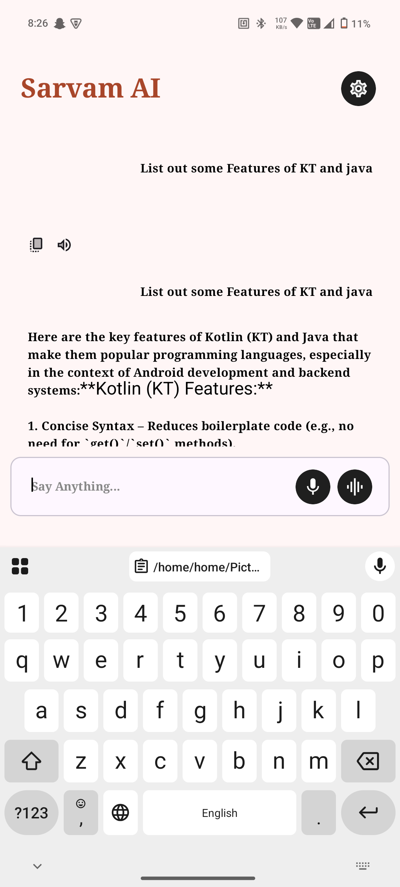

# Sarvam AI Unofficial SDK (Chat, STT, TTS)

An unofficial Kotlin-based Android SDK for interacting with the Sarvam AI APIs. Currently, chat completion, speech-to-text (STT), and text-to-speech (TTS) are supported.

## Features

* Chat Completion: Send a conversation history to Sarvam AI and receive streaming or non-streaming replies.
* Streaming Support: Real-time token streaming via SSE (OkHttp-SSE).
* Speech-to-Text (STT) with audio recording helper.
* Text-to-Speech (TTS) with optional audio playback.
* Simple Retrofit Integration: Non-streaming chat, STT, and TTS via Retrofit + Moshi/Gson.
* Easy API Key Management.
* Incognito Mode: No chats stored.

## Installation

1. Add the `sarvam-sdk` module or source files to your project.
2. In `settings.gradle.kts`:

```kotlin
include(":sarvam-sdk")
```

3. In your `build.gradle.kts`:

```kotlin
implementation(project(":sarvam-sdk"))
```

4. Add your API key in `local.properties`:

```properties
SARVAM_API_KEY=sk_...
```

Or use an environment variable `API_KEY`.

## Usage

### 1. Chat Completion Example

Non-streaming:

```kotlin
val messages = listOf(
  Message(role = "system", content = "You are a helpful assistant."),
  Message(role = "user", content = "Hello!")
)

val request = ChatRequest(messages = messages)

lifecycleScope.launch {
  val reply = ApiClient.sendChat(request).choices.first().message.content
  println(reply)
}
```

Streaming:

```kotlin
ApiClient.streamChat(
  request = ChatRequest(messages = messages),
  onTokenReceived = { token -> print(token) },
  onComplete = { println("Done") },
  onError = { it.printStackTrace() }
)
```

### 2. Speech-to-Text (STT)

```kotlin
STTClient.init("sk_...")
STTClient.startRecording(context)
// After recording
STTClient.stopRecording(
  language = Language.ENGLISH,
  model = STTModels.SAARIKA_V2,
  onSuccess = { transcript -> println(transcript) },
  onError = { it.printStackTrace() }
)
```

### 3. Text-to-Speech (TTS)

```kotlin
TTSClient.init("sk_...")
TTSClient.generate(
  text = "Hello there!",
  modelId = TTSModels.BULBUL_V2,
  languageCode = "en-IN",
  onCompletion = { audioBytes -> TTSClient.playAudio(audioBytes, context) },
  onError = { it.printStackTrace() }
)
```

## Sample App

The `app/` directory provides:

* Chat screen with Compose.
* STT and TTS examples.
* DataStore for API key storage.

## Screenshots

<p align="center">
    
    <br/>
    
</p>

## Roadmap

* Translation API support.
* Image and file upload for GPT vision.
* Official release with documentation.

## License

This SDK is provided unofficially under the MIT License. See `LICENSE` for details.

Note: This SDK is not affiliated with Sarvam AI. Built for experimental purposes only.
